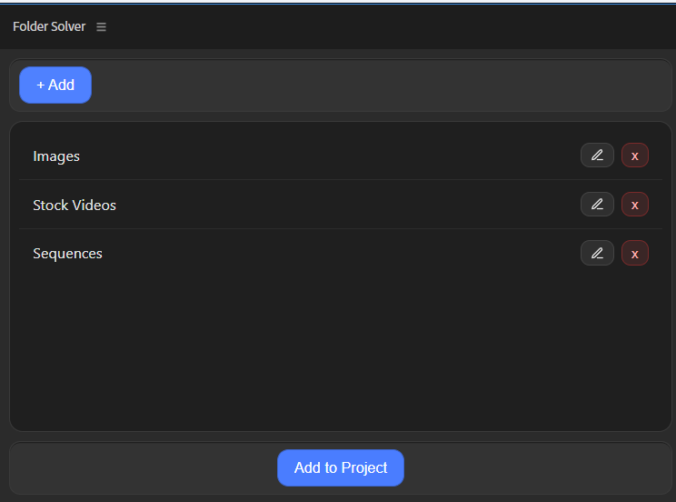

## Folder Solver (Premier Pro Plugin)

The Folder Solver plugin for Adobe Premiere Pro makes project organization effortless. With just one click, you can instantly create multiple predefined folders inside your project, eliminating the repetitive task of manually adding bins each time you start editing. This tool is perfect for video editors who want to maintain a consistent project structure and save valuable time. Whether you work on commercials, films, or YouTube videos, Folder Solver ensures your workspace is clean and organized from the start. Simple, fast, and reliable — it’s the ultimate time-saving companion for any editor who values speed and efficiency in their workflow.

### User Interface

#### Currunt Features 
1. You can manage folders
2. Folder structure remain same even after switchin projects.

#### Planned Features
1. Auto Manage Files and Moved to Respective Bins.

#### --- More Features will be updated Soon ---

## 📃If you want any feature to be added please raise a request 📃.