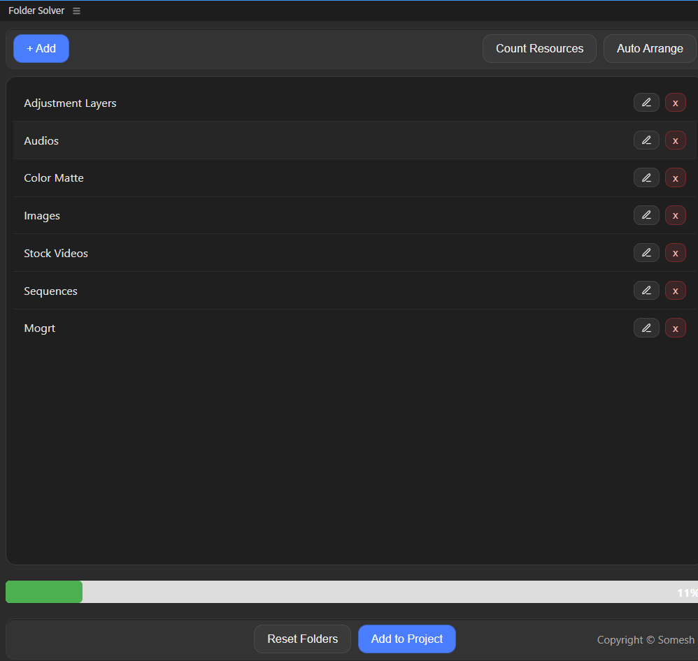

## Folder Solver (Premier Pro Plugin)

FolderSolver is a powerful, time-saving extension for Adobe Premiere Pro designed to help editors instantly organize project assets with ease. Whether you’re dealing with images, videos, audio, motion graphics, adjustment layers, color mattes, sequences, or subtitles, FolderSolver makes managing your project simple, fast, and reliable.

#### - Why FolderSolver?

Managing large Premiere projects can be chaotic. Dragging items manually into bins is slow and error-prone. FolderSolver automates this process, letting you focus on what really matters: editing.

With FolderSolver, you get full control over your project organization, from counting assets to sorting them efficiently into custom folders—all from a sleek, intuitive interface.

#### - Key Features

- `Custom Folder Management`: Add, rename, delete, or reset project bins directly from the plugin panel. Folders are saved persistently in a config file, so your workflow stays consistent every time you open Premiere.

- `Auto Arrange`: Instantly sort your root-level project items into bins based on type—Images, Videos, Audio, Motion Graphics, Adjustment Layers, Color Mattes, Sequences, and Subtitles.

- `Selective Sorting`: Choose which resource types to organize and assign specific bins for each type.

- `Resource Counting`: Quickly scan your project to see how many files you have of each type, without diving into bins manually.

- `Safe and Smooth`: Moves items one at a time with an optional delay to ensure sequences and timelines remain intact.

- `Progress Tracking`: Visual progress bar shows real-time updates as items are moved. Automatically hides when 100% complete.

- `Confirmation & Safety`: Before adding folders to your project, confirm your choices to avoid mistakes.

- `Reset to Default`: Quickly revert to a pre-defined folder structure optimized for editing workflows.

- `Modal Interface`: Clean, intuitive interface with modals for scanning and transferring resources.

#### - How It Works

- Open the FolderSolver panel in Premiere Pro.

- Click “Count Resources” to get an instant overview of your project files.

- Add or edit custom folders using the panel’s intuitive interface.

- Select your target bins for each resource type.

- Click “Auto Arrange” to move items safely into selected bins.

- Watch the progress bar as FolderSolver organizes your project. It automatically disappears once sorting is complete.

#### - Benefits

- Save hours of manual sorting in complex projects.

- Keep your project panel clean, organized, and professional.

- Prevent accidental disruption of sequences or timelines.

- Ensure every resource is in the right place, every time.

- Customizable workflow for individual or team projects.

#### - Ideal For

- Professional video editors working on large-scale projects.

- Freelancers managing multiple client assets.

- Teams collaborating on complex timelines.

- Anyone tired of cluttered Premiere Pro projects.

FolderSolver is more than just a sorting tool—it’s your personal assistant for project organization, helping you maintain workflow efficiency, reduce errors, and boost productivity.

Transform chaos into clarity. Organize smarter, not harder, with FolderSolver.

### User Interface

----

----

----

----

----

----

#### Currunt Features 
1. You can manage folders
2. Folder structure remain same even after switchin projects.

#### Planned Features
1. Auto Manage Files and Moved to Respective Bins.

#### --- More Features will be updated Soon ---

## 📃If you want any feature to be added please raise a request 📃.